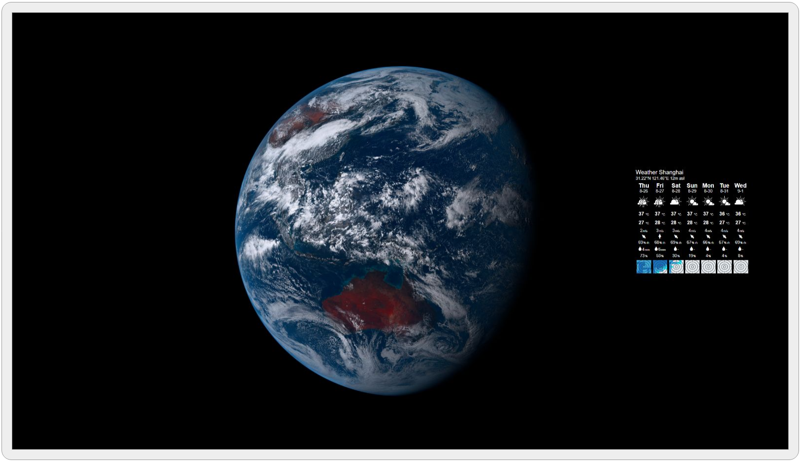

# Live Earth & Weather Forecast 实时地球与天气预报

This is a wallpaper used in [Wallpaper Engine](https://www.wallpaperengine.io/).

这是一个 [Wallpaper Engine](https://www.wallpaperengine.io/zh-hans) 的壁纸.

This project use [Himawari-8](https://himawari8.nict.go.jp/)'s real time full disk image and [meteoblue](https://www.meteoblue.com/)'s weather forecast widget. The copyright of these resources belong to their original author.

该项目中使用了 [向日葵-8](https://himawari8.nict.go.jp/) 卫星的实时全圆盘图像和 [meteoblue](https://www.meteoblue.com/) 的天气预报组件. 这些资源的版权归其原作者所有.

## Demo 预览

## How to use 如何使用

<!-- ENGLISH -->
1. Subscribe in [Steam Workshop](https://steamcommunity.com/sharedfiles/filedetails/?id=2585292351), or clone this repo, or download from [releases](https://github.com/qcmiao1998/LiveEarthWeather/releases).
2. Load it in Wallpaper Engine.
3. Setting this wallpaper:
   * `Earth Size` The size of  the live earth image, set it according to your monitor resolution.
   * `Earth Update Interval` The refresh interval of the earth image, the unit is minutes, the default value is 20 min.
   * `City` The city of weather forecast widget, you can enter the city name or use the latitude and longitude directly. Sometimes the wrong city with the same name may be displayed. In this case, using the latitude and longitude can avoid the problem.
   * `Forecast Update Interval` Similar to `Earth Update Interval`, sets the refresh interval of the weather forecast, the default value is 120 min.

Caution: It may be slow to connect to the Himawari-8's server in China, you can use a CDN server to speed it up. (If the image is not displayed after starting or the image fails to load, it is the network problem.) I have set up a CDN server and wrote it in the code comments, you can switch to it if necessary. (But no guarantees of availability provided, it is better to set up one yourself.)

<!-- CHINESE -->
1. 在 [Steam 创意工坊](https://steamcommunity.com/sharedfiles/filedetails/?id=2585292351) 订阅, 或者克隆这个库, 或者从 [releases](https://github.com/qcmiao1998/LiveEarthWeather/releases) 下载.
2. 把它加载到 Wallpaper Engine.
3. 设置桌面:
   * `Earth Size` 实时地球图像的尺寸, 根据显示器的分辨率情况设置.
   * `Earth Update Interval` 实时地球图像的刷新周期, 单位是分钟, 默认值为 20 分钟.
   * `City` 天气预报的城市, 可以输入城市的名称或者直接输入经纬度. 有的时候可能会显示为错误的同名城市. 这种情况下, 使用经纬度可以规避问题.
   * `Forecast Update Interval` 和 `Earth Update Interval` 类似, 设置天气预报的刷新间隔, 默认值为 120 分钟.

注意: 在中国连接向日葵-8的服务器可能很慢, 可以通过 CDN 来加速. (若启动后迟迟不显示图像或图像加载失败即为网络问题.) 我已经搭建了一个 CDN 加速服务, 地址写在代码注释中, 如有需要可以切换使用. (我的 CDN 不保证可用性, 所以建议还是自己搭一个.)
